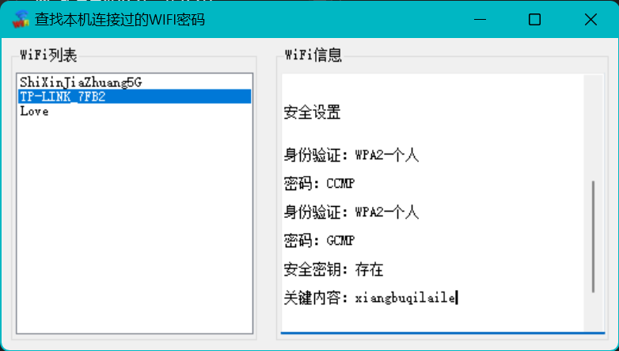

# 查找连接过的WIFI密码

#### 软件介绍
用于查找本机连接过的WIFI密码

#### 软件架构
基于.net framework 4.6 + WinForm窗口

#### 安装教程
下载发行版zip包，vs2017+ 编译就可以了

#### 使用说明
打开软件，左侧显示已连接的软件列表。点击左侧已连接的WIFI名称，右侧显示WIFI信息（包涵密码）

#### 软件截图

#### 感谢
感谢[alexromeo](http://www.alexromeo.net)提供的思路及测试环境！！！